# Automating Download URL Extraction with Python

## Objectives

Malicious office documents are often used as downloaders, macros are executed to begin a sequence of events that ultimately downloads the next stage. Some documents will embed a high number of URLs to download from, such as the document we are investigating. 

The goal is to analyze the macros in this malicious office document to identify how download URLs are stored within the document. Additionally, you will be able to unravel how it uses both VBA and Excel 4 macros.

*Please note - you may need access to the Office Suite (Excel) to follow along with all steps of this analysis*

**The exercise files are in a password-protected archive using a password of:** ***infected***

## Challenge Solutions

### Sample - MD5: 875633e78cc91862b5189e69bd0364c1

1. [What function is used to begin execution of the VBA macros?](#what-function-is-used-to-begin-execution-of-the-vba-macros)

2. [What column/cell does the macro code access in the workbook?](#what-column-and-cell-does-the-macro-code-access-in-the-workbook)

3. [Describe how the large strings in these cells are used? How are they deobfucated?](#describe-how-the-large-strings-in-these-cells-are-used-how-are-they-deobfucated)

4. [Extract all possible download URLs from this document through the creation of a Python script](#extract-all-possible-download-URLs-from-this-document-through-the-creation-of-a-Python-script)

5. [What malware family was this document trying to download?](#what-malware-family-was-this-document-trying-to-download)

## What function is used to begin execution of the VBA macros?

To begin, we’ll investigate what type of macros this document contains – VBA, Excel 4 or both. Starting with OLEDUMP, we’ll see there are a number of macro streams defined in the document:

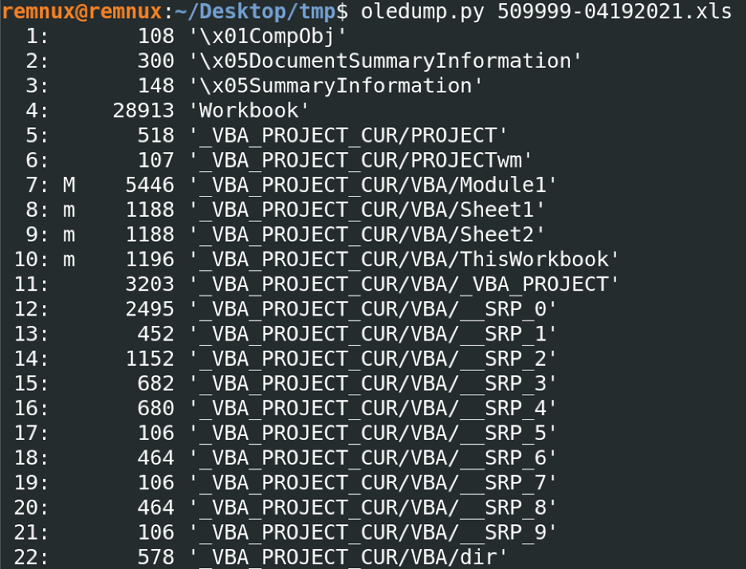

In particular, stream 7 is the most important as the upper-case M indicates that it contains macro code. The lower-case M indicates that those are defined streams for macros, but do not contain any macro content. We can now dump the stream using the following command, redirecting the output to a file with the redirection (“>”) operator:

```$ oledump.py -s 7 -v 509999-04192021.xls > s7```

Opening this file up with a text editor, such as Visual Studio Code will help with the analysis. You can also set the syntax highlighting to “Visual Basic”, as this will help to visually break-up the file along key words and structures within the macro content.

Usually, we would look for an auto_* function – something that would indicate where the code will execute when an important event occurs, such as the opening of the document. There isn’t one here… However, it becomes apparent that the function PAGE1_REVIEW is likely the starting point as it not only contains the most code, but also calls most of the other functions defined. If you have the Office Suite available, you can verify this by opening the document and seeing what function the button “View” is assigned to:

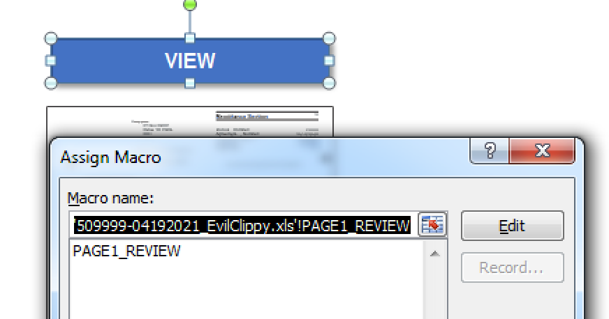

Sure enough – PAGE1_REVIEW! 

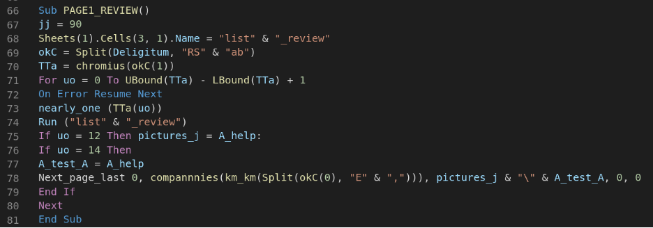

## What column and cell does the macro code access in the workbook?

We can begin by tracing the code at the top of the page. The first function call of significance is to Deligitum – which appears to return a string value, since it is then split by the characters “RSab”. 

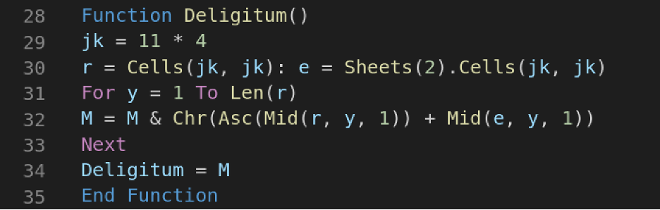

This function begins by defining a variable jk with a value of 44. This value is then used in a call to cell for the both the current worksheet and the worksheet at index 2. Cells will return the content in the cell at row and column, so in each sheet this is row 44 and column 44. Content in the cells can be dumped with the strings, so let’s see if anything interesting jumps out. I’ll use the strings utility with the “-n” argument to increase the minimum length of the string found:

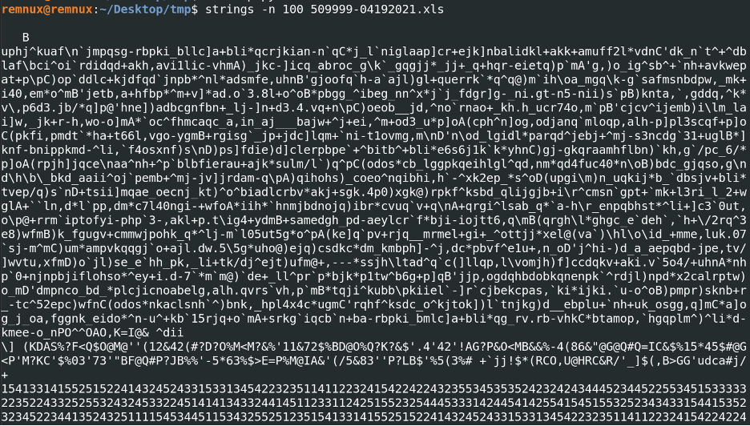

Certainly, some interesting content… Going back to the function, we can see that this cell content is assigned to variables r and e. Then it enters a loop, using the length of r to determine the number of iterations.  Again, if we have the Office suite available, we can look at these cells to confirm our hunch:

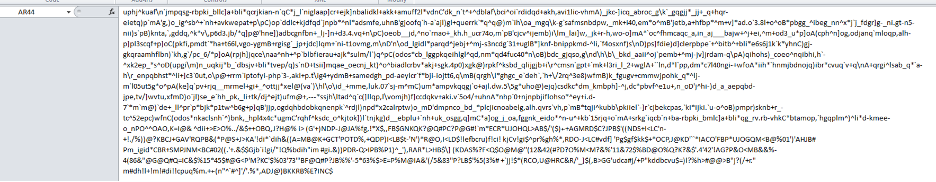

Looks like we’re on to something! The first sheet, in column 44 row 44 there is the content that is the first string we dumped earlier – so this would match up to variable r. If we didn’t have Office handy, we could guess and then switch things around if necessary. Since this appears to be a large, obfuscated string – it’s best to keep digging as it may be our URLs.

## Describe how the large strings in these cells are used? How are they deobfucated?

The next thing the loop does is to iterate on each character of the string r, concatenating to variable M and returning that when it’s done. 

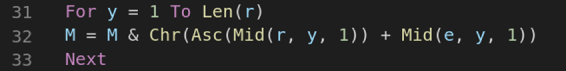

Let’s break this down. First Mid is used to get a single character from each string. The first argument is the input string, the second is the length (which is our counter variable y, or 0 to length of string r) and the final argument tells Mid how much of the string to grab, so 1 character in this loop. The first call to Mid is also wrapped in a call to Asc – which simply returns the numeric value (character code) for the character [MSDN](https://docs.microsoft.com/en-us/office/vba/Language/Reference/user-interface-help/asc-function). This result is then added to the second call to Mid. Now it’s easy to confuse what happens here – instead of becoming a simple string concatenation, a numeric addition happens. If you look at the value of the second string, it is all integer values:


So, what we have is a character from the first string is converted to its character code, the character from the second string is treated like an integer and they’re added together. Finally, a call to Chr is made which converts this new value back into a character, where it can be added to the string M. Phew, that was a mouth full! If this is correct, we can test it a couple of ways. First, with the Office IDE we could set a breakpoint and step to when this function ends – we should see our deobfuscated string:

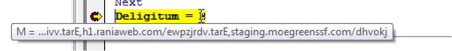

Yep, looks like the URLs we’ve been searching for. If this was one-off analysis, I may decide to call it good here. However, this is Dridex and if we can automate this, then we can extract many URLs as long as they use this technique. Let’s move to a Python script.

As a side note, this maldoc has a protected project – so when you first open it in the Office IDE, you may receive an error such as:

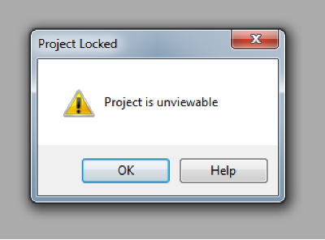

While there are several ways to remove this protection, I find an easy way to use EvilClippy - https://github.com/outflanknl/EvilClippy. You can download the project and follow the instructions to build an executable for your system. After you have a working EXE, you can run it to get help information – the command you’re looking for is “--uu” to remove VBA project protections. I’ve included an “-EvilClippy” version so that you can avoid these steps if you’d like. You can find a short how-to video on my [YouTube channel](https://youtu.be/FqCRYvp001A).

## Extract all possible download URLs from this document through the creation of a Python script

The full Python script is included with the solution, so I’ll just highlight some of the important aspects of the script here.  First, we’ll include the package xlrd to work with Excel documents. This package will be able to parse the workbooks and allow us to programmatically get the cell values. 


I’ve defined a function extract_download_urls, which will do most of the work for us.


This script will take one argument, which is the directory in which your Excel docs are located. It will then iterate through all files in that directory, passing the path to extract_download_urls. Next, a call to open_workbook from the xlrd package will be made, using this path to know where to find the document. 

Now we have an object that represents our spreadsheet. We can utilize the sheets() property to then iterate over all of the rows and columns in each sheet – looking for a cell that contains our strings.  If a value is found, let’s just append it to a list for later processing.

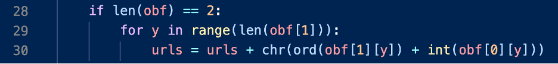

Next up, we have to iterate through our strings. With a little trial and error, I determined that the first string found is the integer array (or string of integer values), while the second is our character array (or string of characters). So obf[1] would map to variable r in the macros, and obf[0] to variable e. All that is left is to call ord in place of Asc – which converts the character to it’s character code. Then call int, which will convert the character directly to the numeric value it represents (so “1” = 1, “5” = 5, this is not converting to the character code as the char code for 1 would be 0x31). These values are added together then converted to a character with the chr function, before being appended to the urls variable.

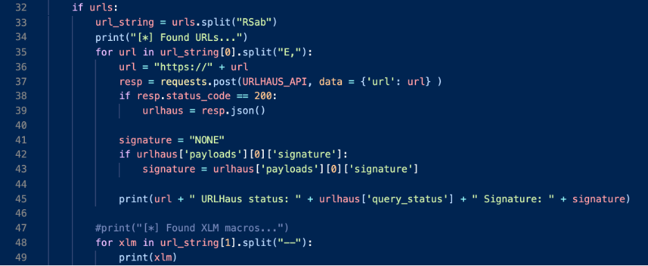

Now we can split on the string “RSab”, which will give us to string values. The first is then split by the string “E,”:

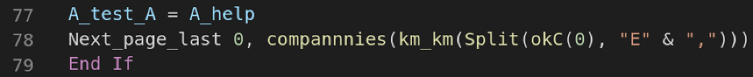

In the original macros, this is done a little later in the code. The second string is then split on two-dashes (“--“), which is done in the function chromius:

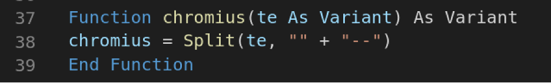

Upgrading the python to account for these splits, and we can easily iterate over the results. 

## What malware family was this document trying to download?

As a bonus, we can check each URL on the URLHaus and get the signature – although we already know it’s Dridex. However, if the URLs weren’t there we could submit them through the URLHaus API 

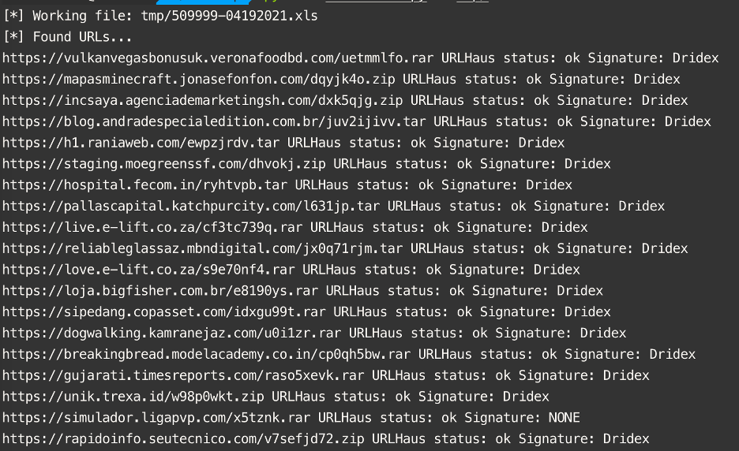

In addition to the URLs, we can also see Excel 4 macros that will be called in sequence:

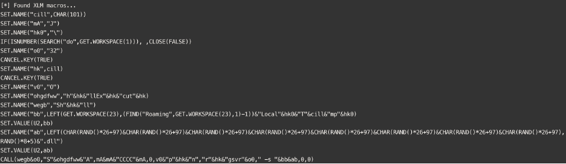

Lots of interesting content to explore!