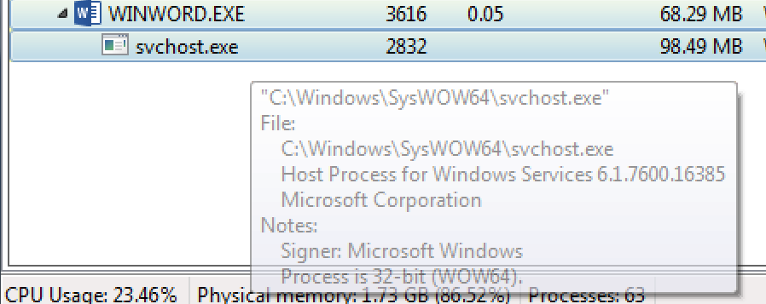
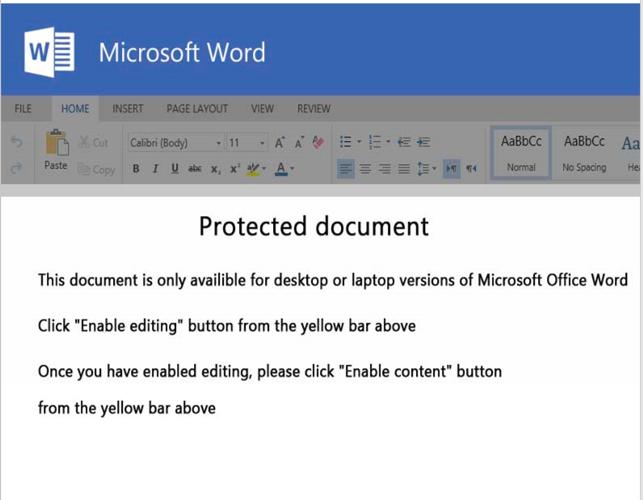

# Tracing Shellcode Execution from VBA Macros

## Objectives

A favored technique by malware authors is to use macros in their office documents to utilize a normal system executable and replace the code inside, a technique known as “process hollowing”.

The primary goal of this lab is to identify this technique and understand how it is employed.

**The exercise files are in a password-protected archive using a password of:** ***infected***

Solutions and walk-through analysis is provided [here](solution.md).

Want to know when the next challenge is released? Follow me on [Twitter](https://twitter.com/jstrosch)!

## Challenge Objectives
### Sample 1 - MD5: b107f3235057bb2b06283030be8f26e4  
### Extracted shellcode - stage1_sc.bin

- This document uses shellcode to perform the “process hollowing” technique:
  - Where is the shellcode stored?

  - How is it staged in memory?

  - How is it executed?

Once you feel comfortable with your analysis of the macro code, move on to analyzing the shellcode.

- Examine the first stage shellcode (stage1_sc.bin):
  - What APIs are part of the process hollowing technique?

  - How does this shellcode resolve module and API addresses?

## Sample information

MITRE ATT&CK Techniques: [T1566 Phishing](https://attack.mitre.org/techniques/T1566/) -> [T1566.001 Spearphishing Attachment](https://attack.mitre.org/techniques/T1566/001/)

## Suggested Tools

All of the necessary tools are installed in the [REMnux](https://remnux.org) distribution.

* Terminal/Command Prompt with Python installed 
* Oledump
* Disassembler (IDA Pro/Ghidra/Binary Ninja)
* Text Editor
* Process Hacker 2 (or other tool to analyze and extract virtual memory)
* Optional: Microsoft Office

## Solution and Walk-Through

[Solution and Walk-Through](solution.md)

## License

This content is licensed under [CC BY-NC-SA 4.0](https://creativecommons.org/licenses/by-nc-sa/4.0/).