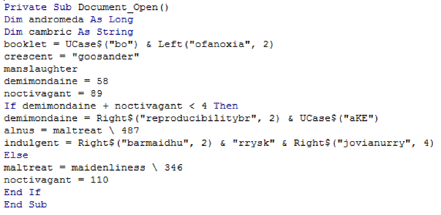
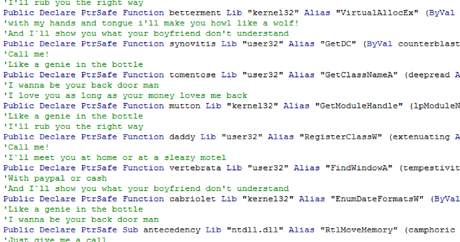
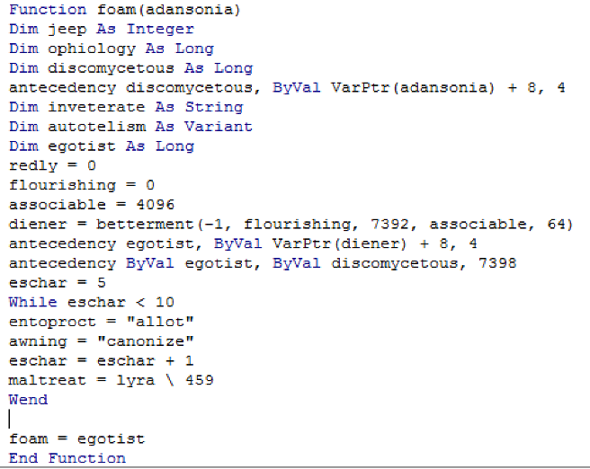
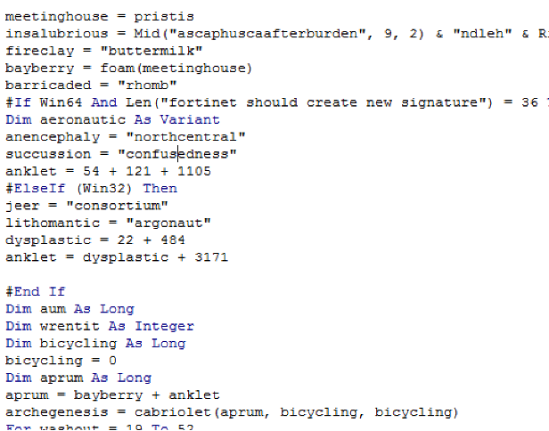
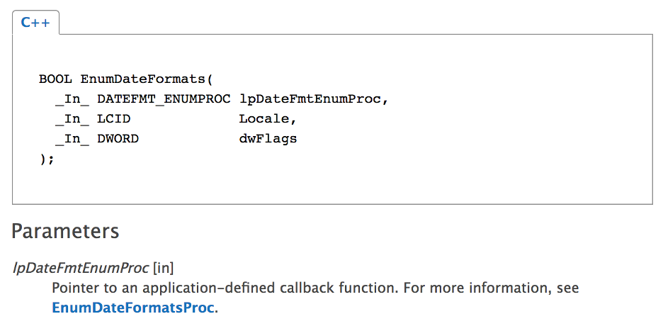
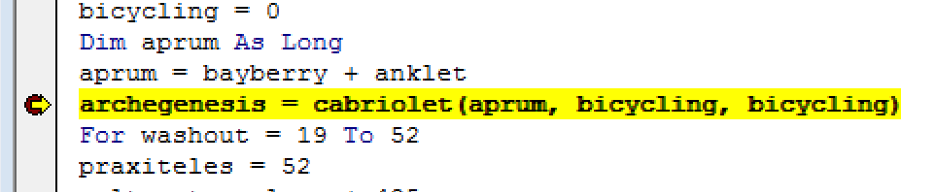
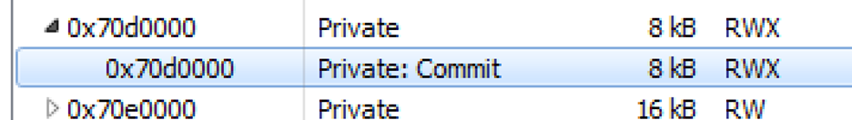
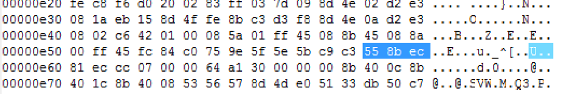
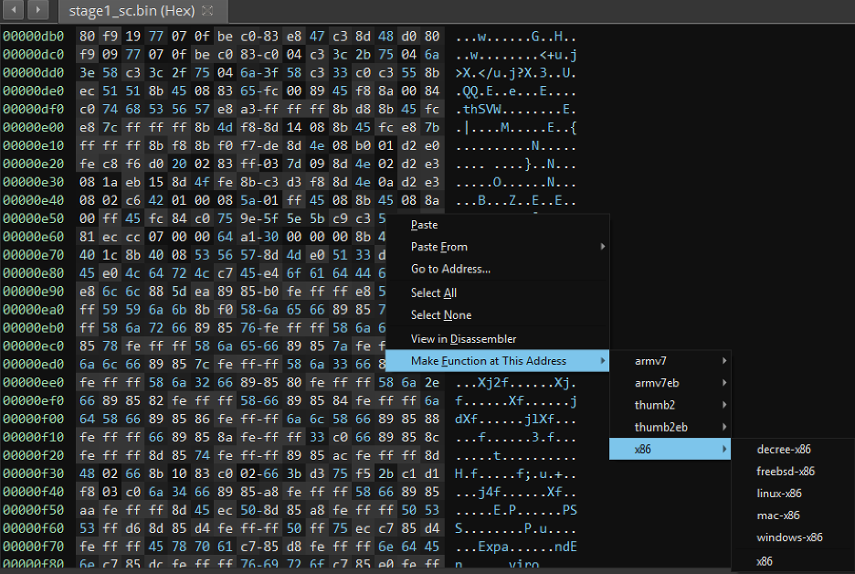
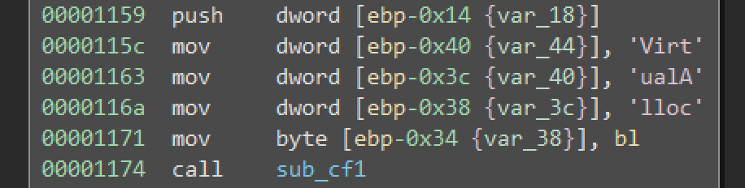

# Tracing Shellcode Execution from VBA Macros

**Please note, the exercise files are in a password-protected archive using a password of:** ***infected***

## Challenge Solutions

- [This document uses shellcode to perform the “process hollowing” technique:](#analyzing-the-macros)
  - Where is the shellcode stored?

  - How is it staged in memory?
  
  - How is it executed?

Once you feel comfortable with your analysis of the macro code, move on to analyzing the shellcode.

- [Examine the first stage shellcode (stage1_sc.bin):](#analyzing-the-shellcode)
  - What APIs are part of the process hollowing technique?

  - How does this shellcode resolve module and API addresses?

## Analyzing the Macros

To get started, inspect the macros and see where the code begins execution. For this document, this begins with the _Document_Open_ function – which can be found in the _ThisDocument_ stream.

As is often the case with the macro code, there is a substantial amount of obfuscation. Since we’ve already dealt with obfuscation in previous labs, we’ll just focus on determining the functionality. This document will be using shellcode to perform the process hollowing technique, let’s focus on finding where this shellcode is staged in memory.

This document has two streams: _ThisDocument_ and _cowkeeper_. At the beginning of the _cowkeeper_ stream you’ll find a series of aliases, which are used to eventually make Windows API calls. Of these functions, _VirtualAllocEx_ and _RtlMoveMemory_ are likely being used for memory allocation and copying shellcode into the allocation. If you’re unfamiliar with any of these APIs, it is worth taking some time to study them on MSDN.

Let’s trace where these are being used – keep in mind that in the VBA that the alias will be used. Let’s start with _betterment_, as the maldoc needs memory to move the shellcode in to. _Betterment_ is called inside the _foam_ function:

_Betterment_, or _VirtualAllocEx_, will return a pointer to the newly allocated memory. This is assigned to _diener_, which is eventually returned by this function. In addition, the use of _RtlMoveMemory_, or _antecedency_, is also used. The next step is to find where this function is called. 

You will also find the call to _foam_ inside the _ThisDocument_ stream:

As you trace the return value through the variable _bayberry_, you’ll see that is used in some simple addition: _bayberry_ + _anklet_. This is assigned to _aprum_ and used as an argument to a function called _cabriolet_. If you look back at all of the aliases we analyzed earlier, you’ll see that this is for the function __EnumDateFormatsW_ – how could this be used to execute shellcode?

Look at the function on MSDN, the first argument (which is our newly allocated memory) expects a pointer to an “application defined callback function”!

The last thing to figure out is what was added to the base of our address before it is called, this could be an offset into the shellcode, which will be important to understand in order to disassemble the code correctly (this essentially defines the entry point). You can continue to trace through the macros to see what this value is, or you can use the office IDE to set a breakpoint and inspect these values dynamically. Either is a viable option. For this guide, I’ll use dynamic analysis to assist me. If you set a breakpoint on the call to _cabriolet_, this will prevent its execution and allow you to view the values of the arguments.

The value, in hex, of _aprum_ was (in this case, the address will change):

Viewing process memory using Process Hacker 2, the base of the RWX allocation is at 0x70D0000, which means there is an offset of 0xE5D.

And here’s our shellcode:

## Analyzing the Shellcode

Once you’ve extracted the shellcode (or you can use stage1_sc.bin from the lab files), you’ll want to disassemble this code, this will allow you to perform analysis on this code. Free/Demo versions of IDA Pro will not disassemble binary content, so for this portion of the lab we’ll be using Binary Ninja (trial at Binary.Ninja). 

Open BN and drag-drop the shellcode into the primary window. BN will likely automatically disassebmle most of the functions in this shellcode and you can navigate to the function _sub_E5D_. However, not all disassemblers will do this and previous versions required manual intervention. For the sake of completeness, the next steps are if you need to manually disassemble from the entry point. Navigate to the offset (entry point) of the code, right-click and select “Make Function at This Address -> x86 -> x86”.

Spend some time analyzing this code and see if you can recognize any patterns.

Since this is shellcode, it will need to construct its own import table – that is, resolve Windows API functions on its own. Normally, when a program is loaded into memory the operating system handles this for the program, since shellcode does not go through the normal process of loading it’s on its own!  As you inspect the code, you’ll notice sequences of hex values being moved onto the stack:

You’ll also notice a call to __sub_cf1__ after this sequence of values. The first technique is called stack-strings, the program is building the ASCII string of the API that it needs to resolve. If you right-click on each hex value, you can change the display to “character constant”. 

It would make sense that any time these strings are used, there must be functionality to resolve the functions. Throughout most of the shellcode the stack strings will be followed by a call to __sub_cf1__. You can confirm this by performing dynamic analysis, set a breakpoint on (or after) the call to _sub_cf1_ and inspect the content of the EAX register – it should be a pointer to the function in the string. 

Of course, going through the binary and changing all of these types can be tedious – since Binary Ninja (and IDA Pro) have a plugin framework, you could automate this work through such plugins. It’s worth spending some time searching for existing plugins, one may already exist!

You can spend some time analyzing _sub_cf1_ if you’re interested in learning how the function addresses are being resolved. However, our focus is to find the process hollowing technique. Process hollowing will include the following APIs:

- CreateProcess
- ZwUnmapViewOfSection
- VirtualAlloc
- WriteProcessMemory
- GetThreadContext
- SetThreadContext
- ResumeThread

Once you are able to identify these strings, you can trace how, and when, they are used in the shellcode. Most of these are used at an offset of 0x11d5. 

CreateProcess will be called to load the desired EXE into memory – one of the arguments will be the path to the EXE, another will be to create the process in a suspended state. Starting in a suspended state stops the process from starting execution. ZwUnmapViewOfSection will be used to remove the original TEXT section of the chosen binary, this allows the shellcode to call VirtualAlloc to allocate new memory, along with WriteProcessMemory to copy new code into the process. From there, it will call GetThreadContext and use the returned value to update the point of entry for the new code. The final steps are to call SetThreadContext and ResumeThread. Now it appears that an instance of SVCHOST is running from the System32 directory, but the actual code has been replaced!

While there is plenty of code to analyze, you should now have a better understanding of how the process hollowing technique works! Continue to explore this code and deepen your knowledge.